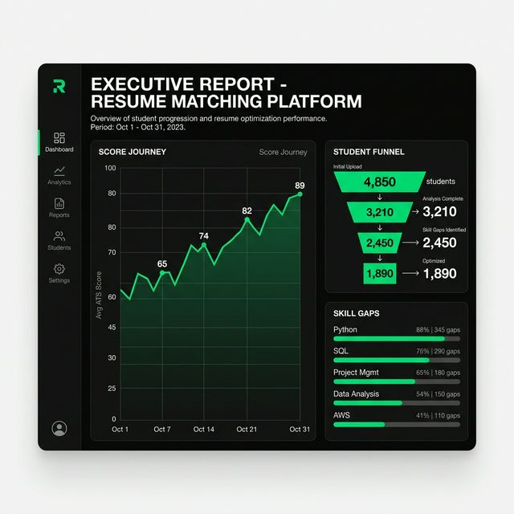

<div align="center">

[](https://www.resumematcher.fyi)

# Resume Matcher

**An AI-Powered, Multi-Tenant ATS Resume Tailoring Platform**

[𝙹𝚘𝚒𝚗 𝙳𝚒𝚜𝚌𝚘𝚛𝚍](https://dsc.gg/resume-matcher) ✦ [𝚆𝚎𝚋𝚜𝚒𝚝𝚎](https://resumematcher.fyi) ✦ [𝙷𝚘𝚠 𝚝𝚘 𝙸𝚗𝚜𝚝𝚊𝚕𝚕](#how-to-install) ✦ [𝙰𝚛𝚌𝚑𝚒𝚝𝚎𝚌𝚝𝚞𝚛𝚎](#architecture) ✦ [𝙼𝚞𝚕𝚝𝚒-𝚃𝚎𝚗𝚊𝚗𝚌𝚢](#multi-tenant-architecture) ✦ [𝙳𝚎𝚙𝚕𝚘𝚢𝚖𝚎𝚗𝚝](#deployment-on-railway)

**English** | [Español](README.es.md) | [简体中文](README.zh-CN.md) | [日本語](README.ja.md)

Create tailored resumes for each job application with AI-powered suggestions. Built for companies and institutions to track cohorts of students through their ATS journey — from Day 1 to Day 6 — with complete data isolation per user.


</div>

<br>

<div align="center">


  

[](https://dsc.gg/resume-matcher) [](https://resumematcher.fyi) [](https://www.linkedin.com/company/resume-matcher/)

<a href="https://trendshift.io/repositories/565" target="_blank"></a>


</div>

> \[!IMPORTANT]
>
> **Version 2.0 — Multi-Tenant Architecture** is now live. This release transforms Resume Matcher from a single-user tool into a scalable, cohort-based platform designed for companies and institutions managing hundreds of students. Every user's data (resumes, jobs, cover letters) is fully isolated.

---

## Table of Contents

- [Overview](#overview)
- [Key Features](#key-features)
- [Architecture](#architecture)
- [Multi-Tenant Architecture](#multi-tenant-architecture)
- [How It Works](#how-it-works)
- [How to Install](#how-to-install)
- [Deployment on Railway](#deployment-on-railway)
- [API Reference](#api-reference)
- [Tech Stack](#tech-stack)
- [Sponsors](#sponsors)
- [Contributors](#contributors)

---

## Overview

Resume Matcher is designed for **companies running placement cohorts** — think 200 students per month, each uploading their resume on Day 1, improving it with AI suggestions, and tracking their ATS progress through Day 6. The platform provides:

- **Per-student data isolation** — Each student only sees their own resumes, jobs, and cover letters.
- **AI-powered resume tailoring** — Paste a job description, get a resume optimized for that role.
- **ATS scoring & SWOT analysis** — Understand how your resume stacks up against Applicant Tracking Systems.
- **Cover letter & email generation** — Auto-generate professional cover letters and outreach emails.
- **PDF export** with multiple professional templates.
- **Multi-language support** — English, Spanish, Chinese, Japanese.

---

## Key Features


### 1. Master Resume Upload & Processing

Upload a comprehensive master resume (PDF or DOCX). The system parses it, extracts structured sections (personal info, experience, education, skills, projects), and stores it as the foundation for all future tailored resumes.


### 2. Job Description Input & AI Tailoring

Paste a job description and the AI analyzes it against your master resume. It generates a tailored version with optimized keywords, restructured bullet points, and content adjustments specific to that role.


### 3. Interactive Resume Builder


The drag-and-drop resume builder lets you:

- **Modify** AI-generated content or write your own
- **Add/remove** sections dynamically
- **Rearrange** sections via drag-and-drop
- **Choose** from multiple professional templates
- **Preview** changes in real-time

### 4. Cover Letter & Email Generator

Generate tailored cover letters and professional outreach emails based on the job description and your resume content.


### 5. ATS Resume Scoring & Feedback

Analyze your resume against the job description. Get a match score, keyword highlighting, and actionable suggestions for improvement. The system provides a detailed breakdown of how you compare to the job requirements.


### 6. Admin Terminal: Executive Report & Cohort Tracking

For instructors and placement officers, the Admin Terminal provides a birds-eye view of an entire cohort's progress.

- **Score Journey Tracking**: See how students improve from their initial master resume to their final tailored applications.
- **Engagement Funnel**: Visualize the cohort's journey from upload to optimized resume.
- **Skill Gap Analysis**: Identify top missing skills across the entire batch to tailor training.
- **Score Growth Metrics**: Track average initial vs. optimized scores to measure the platform's impact.



### 7. PDF Export with Professional Templates

Export your tailored resume and cover letter as polished PDFs using headless Chromium (Playwright).

| Template Name | Preview | Description |
|---------------|---------|-------------|
| **Classic Single Column** |  | A traditional and clean layout suitable for most industries. [𝐕𝐢𝐞𝐰 𝐏𝐃𝐅](assets/pdf-templates/single-column.pdf) |
| **Modern Single Column** |  | A contemporary design with a focus on readability and aesthetics. [𝐕𝐢𝐞𝐰 𝐏𝐃𝐅](assets/pdf-templates/modern-single-column.pdf)|
| **Classic Two Column** |  | A structured layout that separates sections for clarity. [𝐕𝐢𝐞𝐰 𝐏𝐃𝐅](assets/pdf-templates/two-column.pdf)|
| **Modern Two Column** |  | A sleek design that utilizes two columns for better organization. [𝐕𝐢𝐞𝐰 𝐏𝐃𝐅](assets/pdf-templates/modern-two-column.pdf)|

### 8. Internationalization

- **Multi-Language UI**: Interface available in English, Spanish, Chinese, and Japanese
- **Multi-Language Content**: Generate resumes and cover letters in your preferred language

---

## Architecture

Resume Matcher follows a **monorepo** structure with a clear separation between backend and frontend:

```
Resume-Matcher/
├── apps/
│   ├── backend/               # FastAPI + Python 3.13
│   │   ├── app/
│   │   │   ├── main.py        # FastAPI app entry point
│   │   │   ├── config.py      # Pydantic settings (env vars, CORS, LLM config)
│   │   │   ├── models.py      # SQLModel data models (User, Cohort, Resume, Job)
│   │   │   ├── database.py    # SQL database layer with tenant-scoped CRUD
│   │   │   ├── auth.py        # X-User-ID header extraction dependency
│   │   │   ├── worker.py      # Celery background worker for async tasks
│   │   │   └── routers/
│   │   │       ├── resumes.py # Resume upload, processing, tailoring, PDF gen
│   │   │       ├── jobs.py    # Job description management
│   │   │       └── enrichment.py # AI-powered resume improvement
│   │   ├── seed.py            # Database seeding script for test users/cohorts
│   │   ├── start.sh           # Entrypoint: runs both Celery + FastAPI in a managed venv
│   │   ├── Dockerfile
│   │   └── pyproject.toml
│   │
│   └── frontend/              # Next.js 15 + React 19 + TypeScript
│       ├── app/
│       │   ├── (default)/
│       │   │   ├── dashboard/ # Main dashboard with resume cards
│       │   │   ├── resumes/   # Resume viewer/editor pages
│       │   │   ├── tailor/    # Job description input + AI tailoring
│       │   │   ├── builder/   # Drag-and-drop resume builder
│       │   │   ├── settings/  # LLM provider configuration
│       │   │   └── layout.tsx # Default layout with UserSwitcher
│       │   └── print/         # Server-rendered pages for PDF generation
│       ├── components/
│       │   └── common/
│       │       └── user-switcher.tsx # Identity switcher for testing
│       ├── lib/
│       │   └── api/
│       │       ├── client.ts  # Centralized API client (injects X-User-ID)
│       │       └── auth.ts    # User identity management (localStorage)
│       └── Dockerfile
│
├── railway.json               # Railway configuration for deployment
├── docker-compose.yml         # Local Docker development
└── Makefile                   # Development shortcuts
```

### Request Flow

```
Browser → Next.js Frontend → apiFetch() [injects X-User-ID header]
                                 ↓
                          FastAPI Backend
                                 ↓
                    get_current_user(X-User-ID)
                                 ↓
                    Tenant-scoped database query
                                 ↓
                    SQLModel → PostgreSQL / SQLite
```

Every API request follows this chain:

1. The **frontend** reads the current user ID from `localStorage` and attaches it as an `X-User-ID` HTTP header via the centralized `apiFetch()` wrapper.
2. The **backend** extracts this header using the `get_current_user` FastAPI dependency.
3. All **database operations** are scoped to that `user_id`, ensuring complete data isolation.

---

## Multi-Tenant Architecture

This is the core architectural change that transforms Resume Matcher from a personal tool into an enterprise-grade cohort tracking platform.

### Why Multi-Tenancy?

When a company runs monthly placement cohorts of 200 students:
- Each student needs their **own** master resume, tailored resumes, and job descriptions
- An instructor needs to be able to **switch contexts** to view any student's progress
- Data must be **fully isolated** — Student A cannot see Student B's resumes

### Database Schema

Four core models power the multi-tenant system:

```
┌─────────────┐     ┌──────────────┐
│   Cohort    │     │     User     │
├─────────────┤     ├──────────────┤
│ cohort_id   │◄────│ cohort_id    │
│ name        │     │ user_id (PK) │
│ start_date  │     │ name         │
└─────────────┘     │ email        │
                    └──────┬───────┘
                           │ user_id (FK)
              ┌────────────┴────────────┐
              ▼                         ▼
      ┌──────────────┐         ┌──────────────┐
      │   Resume     │         │     Job      │
      ├──────────────┤         ├──────────────┤
      │ resume_id    │         │ job_id       │
      │ user_id (FK) │         │ user_id (FK) │
      │ is_master    │         │ content      │
      │ parent_id    │         │ created_at   │
      │ filename     │         └──────────────┘
      │ raw_resume   │
      │ processed_   │
      │   resume     │
      │ cover_letter │
      └──────────────┘
```

- **Cohort**: Groups students by batch (e.g., "March 2026 Batch")
- **User**: Individual students with `user_id`, `name`, `email`, linked to a cohort
- **Resume**: Each resume has a `user_id` FK. The `parent_id` field tracks resume versions (Day 1 original → Day 6 improved). The `is_master` flag identifies the primary resume.
- **Job**: Job descriptions are also scoped per user via `user_id` FK.

### Authentication (MVP)

For the MVP, we use a lightweight **mocked identity** system via the `X-User-ID` HTTP header:

**`apps/backend/app/auth.py`**
```python
from fastapi import Header
from typing import Optional

async def get_current_user(x_user_id: Optional[str] = Header(None)) -> Optional[str]:
    """Extract user identity from X-User-ID header."""
    return x_user_id
```

This dependency is injected into every endpoint:
```python
@router.post("/resumes/upload")
async def upload_resume(
    file: UploadFile,
    user_id: Optional[str] = Depends(get_current_user),
):
    # All database operations are scoped to user_id
    resume = db.create_resume(user_id=user_id, ...)
```

### Frontend Integration

**API Client (`lib/api/client.ts`)** — Every request automatically includes the user context:
```typescript
import { getUserId } from './auth';

export async function apiFetch(endpoint: string, options: RequestInit = {}) {
  const userId = getUserId();
  const headers = {
    ...options.headers,
    'X-User-ID': userId,
  };
  // ... fetch with headers
}
```

**Auth Utility (`lib/api/auth.ts`)** — Manages identity in `localStorage`:
```typescript
const STORAGE_KEY = 'rm_user_id';
const DEFAULT_USER = 'student_001';

export function getUserId(): string {
  if (typeof window === 'undefined') return DEFAULT_USER;
  return localStorage.getItem(STORAGE_KEY) || DEFAULT_USER;
}

export function setUserId(id: string): void {
  localStorage.setItem(STORAGE_KEY, id);
  window.location.reload(); // Reload to fetch new user's data
}
```

**User Switcher Component** — A floating button in the bottom-right corner allows quickly switching between student identities for testing and instructor review:

```
┌─────────────────────┐
│  Switch Context      │
│                      │
│  ● Student 1 (Day 1) │  ← currently selected
│    Student 2 (TL)    │
│    Student 3 (PM)    │
│    Admin/Instructor  │
│                      │
│  MVP: X-User-ID      │
└─────────────────────┘
        [👥]  ← floating button
```

### Scoped Database Operations

Every database method is scoped to the requesting user:

```python
# Only returns resumes belonging to this specific user
def list_resumes(self, user_id: str = None) -> list[dict]:
    query = select(Resume)
    if user_id:
        query = query.where(Resume.user_id == user_id)
    ...

# Each user has their own master resume
def get_master_resume(self, user_id: str = None) -> dict | None:
    query = select(Resume).where(Resume.is_master == True)
    if user_id:
        query = query.where(Resume.user_id == user_id)
    ...
```

### PDF Generation with User Context

When generating PDFs, the backend passes the `userId` as a query parameter to the frontend print pages. This ensures the headless browser fetches the correct user's data:

```python
url = f"{settings.frontend_base_url}/print/resumes/{resume_id}?{params}"
if user_id:
    url = f"{url}&userId={user_id}"
```

The print page then uses this `userId` to set the `X-User-ID` header when fetching resume data from the API.

---

## How It Works

1. **Upload** your master resume (PDF or DOCX)
2. **Paste** a job description you're targeting
3. **Review** AI-generated improvements and tailored content
4. **Cover Letter & Email** generator for the job application
5. **Customize** the layout and sections to fit your style
6. **Export** as a professional PDF with your preferred template

### Stay Connected

[](https://dsc.gg/resume-matcher)

Join our [Discord](https://dsc.gg/resume-matcher) for discussions, feature requests, and community support.

[](https://www.linkedin.com/company/resume-matcher/)

Follow us on [LinkedIn](https://www.linkedin.com/company/resume-matcher/) for updates.


Star the repo to support development and get notified of new releases.

---

<a id="how-to-install"></a>

## How to Install


For detailed setup instructions, see **[SETUP.md](SETUP.md)** (English) or: [Español](SETUP.es.md), [简体中文](SETUP.zh-CN.md), [日本語](SETUP.ja.md).

### Prerequisites

| Tool | Version | Installation |
|------|---------|--------------|
| Python | 3.13+ | [python.org](https://python.org) |
| Node.js | 22+ | [nodejs.org](https://nodejs.org) |
| uv | Latest | [astral.sh/uv](https://docs.astral.sh/uv/getting-started/installation/) |

### Quick Start (Local Development)

Fastest for MacOS, WSL and Ubuntu users:

```bash
# Clone the repository
git clone https://github.com/Luciferai04/resume-matcher-render.git
cd resume-matcher-render

# Backend (Terminal 1)
cd apps/backend
cp .env.example .env        # Configure your AI provider
uv sync                      # Install dependencies
uv run uvicorn app.main:app --reload --port 8000

# Frontend (Terminal 2)
cd apps/frontend
npm install
npm run dev
```

Open **<http://localhost:3000>** and configure your AI provider in Settings.

### Seed the Database (Optional)

To populate the database with test users and cohorts for multi-tenant testing:

```bash
cd apps/backend
python seed.py
```

This creates:
- A **"March 2026 Batch"** cohort
- Four test users: `student_001`, `student_002`, `student_003`, `admin_demo`

Use the **User Switcher** (👥 button in the bottom-right) to toggle between these identities.

### Supported AI Providers

| Provider | Local/Cloud | Notes |
|----------|-------------|-------|
| **Ollama** | Local | Free, runs on your machine |
| **OpenAI** | Cloud | GPT-4o, GPT-4o-mini |
| **Anthropic** | Cloud | Claude 3.5 Sonnet |
| **Google Gemini** | Cloud | Gemini 1.5 Flash/Pro |
| **OpenRouter** | Cloud | Access to multiple models |
| **DeepSeek** | Cloud | DeepSeek Chat |

### Docker Deployment (Local)

```bash
docker compose up --build
```

> **Using Ollama with Docker?** Use `http://host.docker.internal:11434` as the Ollama URL instead of `localhost`.

---

## Deployment on Railway

Resume Matcher is configured for fast, reliable cloud deployment on [Railway.app](https://railway.app). The repository includes a `railway.json` file to establish Docker configurations as standard for Railway templates.

### What Gets Deployed

| Service | Type | Plan | Description |
|---------|------|------|-------------|
| **rm-backend** | Web Service (Docker) | Hobby/Pro | FastAPI backend + Celery worker (consolidated) |
| **rm-frontend** | Web Service (Docker) | Hobby/Pro | Next.js frontend |
| **rm-database** | PostgreSQL | Managed | Managed PostgreSQL database |
| **rm-redis** | Redis | Managed | Message broker for Celery tasks |

### How to Deploy

1. **Fork or push** this repository to your GitHub account
2. Go to [Railway Dashboard](https://railway.app/dashboard) → **New Project** → **Deploy from GitHub repo**
3. Select your repository. Railway will automatically detect the monorepo structure and prompt you to set up services for `apps/frontend` and `apps/backend`.
4. Add **PostgreSQL** and **Redis** from the **New** button in the canvas.
5. Provide the backend with the connection URLs by right-clicking the Database and Redis services and selecting "Connect", or use variable references.

   | Variable | Value | Description |
   |----------|-------|-------------|
   | `LLM_PROVIDER` | `gemini` / `openai` / etc. | Your AI provider |
   | `LLM_MODEL` | `gemini-1.5-flash` / etc. | Model identifier |
   | `LLM_API_KEY` | `your-api-key` | Provider API key |
   | `DATABASE_URL` | `${{Postgres.DATABASE_URL}}` | Reference to Railway Postgres |
   | `REDIS_URL` | `${{Redis.REDIS_URL}}` | Reference to Railway Redis |
   | `CORS_ORIGINS` | `${{frontend.PUBLIC_DOMAIN}},http://localhost:3000` | Whitelist the frontend domain |

6. Configure the `NEXT_PUBLIC_API_URL` for the frontend service:
   1. Go to the **Variables** tab for your frontend container
   2. Set `NEXT_PUBLIC_API_URL` to `https://${{backend.PUBLIC_DOMAIN}}`
   3. This build ARG will be dynamically injected during Railway's Next.js build.

### Key Deployment Decisions

1. **Consolidated Backend + Worker**: We consolidated the Celery worker into the backend container using a `start.sh` entrypoint that runs both processes, making deployments much cheaper and easier to manage:

   ```bash
   #!/bin/bash
   celery -A app.worker.celery_app worker --loglevel=info &
   uvicorn app.main:app --host 0.0.0.0 --port 8000
   ```

2. **CORS Configuration**: The `CORS_ORIGINS` environment variable is parsed by Pydantic. A `field_validator` was added to `config.py` to handle both `*` (plain string), comma-separated strings, and `["*"]` (JSON array) formats.

3. **Frontend ↔ Backend URL**: The frontend dynamically reads `NEXT_PUBLIC_API_URL` exclusively at build time. On Railway, this is passed automatically via the container variables.

---

## API Reference

All API endpoints are prefixed with `/api/v1/` and require the `X-User-ID` header for multi-tenant operations.

### Health & Status

| Method | Endpoint | Description |
|--------|----------|-------------|
| `GET` | `/api/v1/health` | Health check |
| `GET` | `/api/v1/status` | System status (LLM configured, resume count) |

### Resumes

| Method | Endpoint | Description |
|--------|----------|-------------|
| `POST` | `/api/v1/resumes/upload` | Upload a master resume (PDF/DOCX) |
| `GET` | `/api/v1/resumes` | Get resume by `resume_id` query param |
| `GET` | `/api/v1/resumes/list` | List all resumes for the current user |
| `DELETE` | `/api/v1/resumes/{id}` | Delete a specific resume |
| `POST` | `/api/v1/resumes/{id}/retry` | Retry failed processing |
| `POST` | `/api/v1/resumes/{id}/generate-pdf` | Generate PDF for a resume |
| `POST` | `/api/v1/resumes/{id}/generate-cover-letter-pdf` | Generate cover letter PDF |

### Jobs

| Method | Endpoint | Description |
|--------|----------|-------------|
| `POST` | `/api/v1/jobs/upload` | Upload a job description |
| `GET` | `/api/v1/jobs/{id}` | Get a specific job description |

### Enrichment

| Method | Endpoint | Description |
|--------|----------|-------------|
| `POST` | `/api/v1/enrichment/improve` | Preview AI improvements |
| `POST` | `/api/v1/enrichment/confirm` | Confirm and apply improvements |
| `POST` | `/api/v1/enrichment/regenerate` | Regenerate with different parameters |

---

## Tech Stack

| Component | Technology |
|-----------|------------|
| Backend | FastAPI, Python 3.13+, LiteLLM, Celery |
| Frontend | Next.js 15, React 19, TypeScript |
| Database | SQLModel + SQLite (local) / PostgreSQL (production) |
| Cache/Broker | Redis (Valkey 8) for Celery task queue |
| Auth (MVP) | `X-User-ID` header with localStorage persistence |
| Styling | Tailwind CSS 4, Swiss International Style |
| PDF Generation | Headless Chromium via Playwright |
| Deployment | Render Blueprint (Docker) |
| CI/CD | Auto-deploy on push to `main` branch |

---

## Sponsors


We are grateful to our sponsors who help keep this project going. If you find Resume Matcher helpful, please consider [**sponsoring us**](https://github.com/sponsors/srbhr) to ensure continued development and improvements.

| Sponsor | Description |
|---------|-------------|
| [APIDECK](https://apideck.com?utm_source=resumematcher&utm_medium=github&utm_campaign=sponsors) | One API to connect your app to 200+ SaaS platforms (accounting, HRIS, CRM, file storage). Build integrations once, not 50 times. 🌐 [apideck.com](https://apideck.com?utm_source=resumematcher&utm_medium=github&utm_campaign=sponsors) |
| [Vercel](https://vercel.com?utm_source=resumematcher&utm_medium=github&utm_campaign=sponsors) | Resume Matcher is a part of Vercel OSS // Summer 2025 Program 🌐 [vercel.com](https://vercel.com?utm_source=resumematcher&utm_medium=github&utm_campaign=sponsors) |
| [Cubic.dev](https://cubic.dev?utm_source=resumematcher&utm_medium=github&utm_campaign=sponsors) | Cubic provides PR reviews for Resume Matcher 🌐 [cubic.dev](https://cubic.dev?utm_source=resumematcher&utm_medium=github&utm_campaign=sponsors) |
| [Kilo Code](https://kilo.ai?utm_source=resumematcher&utm_medium=github&utm_campaign=sponsors) | Kilo Code provides AI code reviews and coding credits to Resume Matcher 🌐 [kilo.ai](https://kilo.ai?utm_source=resumematcher&utm_medium=github&utm_campaign=sponsors) |

<a id="support-the-development-by-donating"></a>

## Sponsor Resume Matcher


Please read our [Sponsorship Guide](https://resumematcher.fyi/docs/sponsoring) for details on how your sponsorship helps the project. You will receive a special thank you in the ReadME and on our website.

| Platform  | Link                                   |
|-----------|----------------------------------------|
| GitHub    | [](https://github.com/sponsors/srbhr) |
| Buy Me a Coffee | [](https://www.buymeacoffee.com/srbhr) |


Thank you for checking out Resume Matcher. If you want to connect, collaborate, or just say hi, feel free to reach out!
~ **Saurabh Rai** ✨

You can follow me on:

- Website: [https://srbhr.com](https://srbhr.com)
- Linkedin: [https://www.linkedin.com/in/srbhr/](https://www.linkedin.com/in/srbhr/)
- Twitter: [https://twitter.com/srbhrai](https://twitter.com/srbhrai)
- GitHub: [https://github.com/srbhr](https://github.com/srbhr)

---

## Join Us and Contribute


We welcome contributions from everyone! Whether you're a developer, designer, or just someone who wants to help out. All the contributors are listed in the [about page](https://resumematcher.fyi/about) on our website and on the GitHub Readme here.

### Roadmap

- ✅ Multi-tenant architecture with per-user data isolation
- ✅ Pre-configured deployment for Railway with venv support
- ✅ User context switcher for testing/instructor review
- ✅ Consolidated backend + worker for Free tier hosting
- ✅ Instructor dashboard (Executive Report) for cohort tracking
- 🔲 Full OAuth/JWT authentication
- 🔲 Database migrations with Alembic
- 🔲 Visual keyword highlighting (Full Canvas)
- 🔲 AI Canvas for crafting impactful, metric-driven resume content
- 🔲 Multi-job description optimization

<a id="contributors"></a>

## Contributors


<a href="https://github.com/srbhr/Resume-Matcher/graphs/contributors">
  
</a>

<br/>

<details>
  <summary><kbd>Star History</kbd></summary>
  <picture>
    <source media="(prefers-color-scheme: dark)" srcset="https://api.star-history.com/svg?repos=srbhr/resume-matcher&theme=dark&type=Date">
    
  </picture>
</details>

## Resume Matcher is a part of [Vercel Open Source Program](https://vercel.com/oss)


