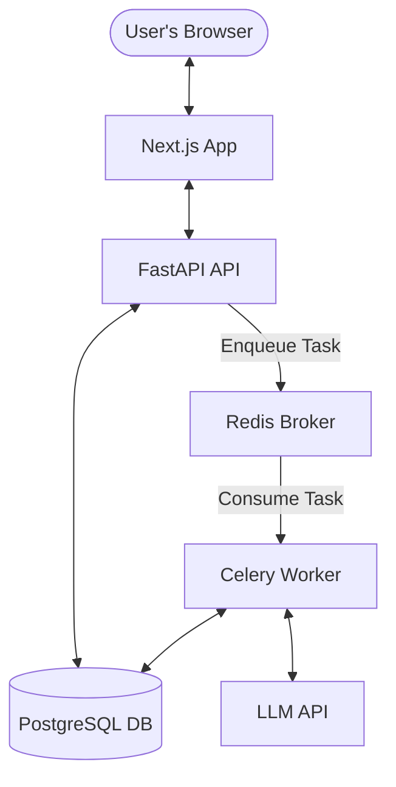

# Scaling the Resume Matcher 🚀

To handle more concurrent users and ensure high availability, I have migrated the application from a local file-based architecture to a production-ready containerized environment.

## Key Scalability Improvements

1.  **PostgreSQL Migration**: Switched from `TinyDB` (which locks the entire database file during writes) to `PostgreSQL` using `SQLModel`. This allows for high-concurrency access and robust data integrity.
2.  **Background Task Worker**: Integrated `Celery` with `Redis` to offload intensive operations (like LLM-based resume parsing) to background workers. This keeps the API responsive and prevents timeouts during heavy load.
3.  **Containerization**: Added `Docker` and `Docker Compose` configurations to simplify deployment and scaling. You can now easily spin up multiple backend workers.
4.  **SQL Database Abstraction**: Implemented a flexible database layer that defaults to `PostgreSQL` in production but uses `SQLite` for local development if needed.

## Architecture



## How to Deploy

### 1. Configure Environment
Create a `.env` file in the root directory with your settings:
```env
LLM_PROVIDER=gemini
LLM_MODEL=gemini-1.5-flash
LLM_API_KEY=your_key_here
DB_USER=postgres
DB_PASSWORD=postgres
DB_NAME=resume_matcher
```

### 2. Start the Stack
Run the following command to build and start all services:
```bash
make up
```
This will start:
- **FastAPI Backend** on port 8000
- **Next.js Frontend** on port 3000
- **PostgreSQL** on port 5432
- **Redis** on port 6379
- **Celery Worker** for background tasks

### 3. Monitoring
- View logs: `make logs`
- Check service status: `make ps`
- Stop services: `make down`

## Handling 1000+ Users
For this scale, this architecture is perfectly suited. You can scale the backend horizontally by increasing the number of replicas in a Kubernetes cluster or AWS ECS. The Redis/Celery queue ensures that even if 100 users upload resumes at the exact same moment, the system will process them one-by-one without crashing.
